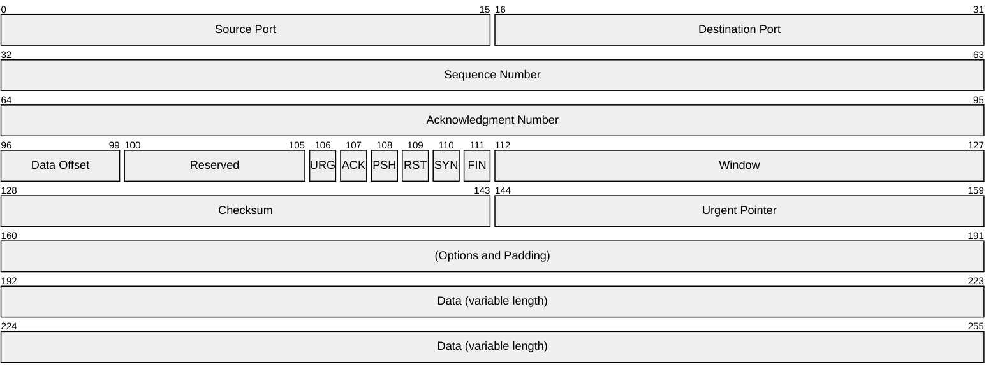

# Wireguard & NAT Traversal Experience
## Introduction
The aim of this laboratory experience is to understand how Wireguard works and how it can be used to traverse NATs. You will use some network tools as Wireshark to analyse the packets exchanged between the peers. You will also use some network devices as MikroTik and Alpine Linux hosts to create a VPN tunnel between two peers behind NATs.
At the end of this experience, you will be able to configure Wireguard VPN tunnels and you will have a better understanding of how NAT works, how it affects the packets exchanged between peers and how to traverse it.
## Theoretical background
### Wireguard
Wireguard is a modern VPN protocol that aims to be simple, fast and secure. It uses state-of-the-art cryptography and is designed to be easy to configure and use. Wireguard is based on the concept of "peers", which are the endpoints of the VPN tunnel. Each peer has a public and private key pair, which are used to authenticate and encrypt the packets exchanged between them. Wireguard uses UDP as the transport protocol and it is designed to be lightweight and efficient.
#### Wireguard Architecture

#### Wireguard Cryptography
Wireguard uses the following cryptographic primitives:
- ChaCha20 for symmetric encryption, authenticated with Poly1305, using RFC7539's AEAD construction
- Curve25519 for ECDH
- BLAKE2s for hashing and keyed hashing, described in RFC7693
- SipHash24 for hashtable keys
- HKDF for key derivation, as described in RFC5869

...

### NAT
Network Address Translation (NAT) is a technique used to modify the IP address and/or port number of packets as they pass through a router or firewall. NAT is commonly used to allow multiple devices on a private network to share a single public IP address. NAT can cause problems for VPN protocols, as it can change the source and destination IP addresses and port numbers of the packets, making it difficult for the peers to communicate with each other. Wireguard uses a technique called "persistent keepalive" to keep the connection alive and to traverse NATs.
#### NAT Types
There are two macro-categories of NATs:
- Basic NAT (one-to-one), mainly employed to interconnect IP networks with incompatible addresses. This type of NAT will not be covered in this laboratory experience.
- One-to-many NAT, which maps multiple private hosts, each one having a private IP address, to one - sometimes public - external IP address. The aim is to have a singular public IP address for multiple devices in order to tackle IPv4 address space exhaustion. For TCP segments and UDP datagrams, as outgoing traffic passes throughout the NAT device (usually, a router), intended to reach external destinations, the device replaces the private source IP address in each packet header with its own public IP address and the source port with another one, later used to correctly forward incoming packets. Indeed, as incoming traffic reaches the NAT device, it replaces back the original source IP address and port in the destination fields. Therefore, the device performs a kind of connection tracking. 
This process is sometimes more strictly named network address and port translation (NAPT). 

There are many types of One-to-many NATs:
- Endpoint-Independent NAT, Full Cone NAT: Once an internal address (iAddr:iPort) is mapped to an external address (eAddr:ePort), any packets from iAddr:iPort are sent through eAddr:ePort. Any external host can send packets to iAddr:iPort by sending packets to eAddr:ePort. This the simplest type of NAPT.
- Address-Dependent NAT, Restricted Cone NAT: as far as outgoing traffic is concerned, the behaviour is the same as Full Cone NAT. However, incoming traffic gets forwarded to the internal hosts only if iAddr:iPort has previously sent a packet to hAddr:any. Any means the port number doesn't matter.
- Address and Port-Dependent NAT, Port Restricted Cone NAT: same as Restricted Cone NAT but the port numbers matter too.
- Address and Port-Dependent NAT, Symmetric NAT: The combination of one internal IP address and a destination IP address and port is mapped to a single unique external source IP address and port; if the same internal host sends a packet even with the same source address and port but to a different destination, a different mapping is used.
Only an external host that receives a packet from an internal host can send a packet back.

#### NAT Traversal
When hosts belonging to different LANs try to communicate, they cannot do it directly as they were not assigned publicly routable IP addresses. One way to solve this problem is to use port forwarding and address incoming packets to the router public IP address. However, this is impractical, as it requires user configuration, it is not dynamic (UPnP deals with this issue but brings its own problems) and it is not always feasible, especially on mobile networks, where ISPs deploy their own NATs.

### Wireshark
Wireshark is a network protocol analyzer that allows you to capture and analyze the packets exchanged between the peers. Wireshark can be used to inspect the packets at different layers of the OSI model, including the application layer, transport layer and network layer. Wireshark can also be used to filter the packets based on different criteria, such as IP address, port number and protocol.

#### Some wireshark filters
...

### GNS3
GNS3 is a network simulation tool that allows you to create and simulate complex network topologies. GNS3 can be used to create virtual machines, routers, switches and other network devices. GNS3 can also be used to connect the virtual devices to real devices, allowing you to create hybrid networks.


## Laboratory experience
### Appliances setup
#### Alpine Linux containers
Explain how to create the Alpine Linux containers. A Docker image with Wireguard preinstalled is available on Docker Hub.
#### MikroTik RB4011iGS+
Explain how to create the MikroTik RB4011iGS+ router. You can use the GNS3 appliance available on the GNS3 marketplace, which will ask you to download the appropriare RouterOS image.

### Scenario A
#### Topology
Add images of the various topologies created in GNS3
#### Configuration

### Scenario B
#### Topology
Add images of the various topologies created in GNS3
#### Configuration

# MikroTik

## Bottom
```
/interface bridge add name=bridge1
/interface bridge port add interface=ether2 bridge=bridge1
/interface bridge port add interface=ether3 bridge=bridge1
/ip address add address=192.168.1.1/24 interface=bridge1
ip dhcp-server/ setup
/ip dhcp-client add disabled=no interface=ether1
/ip firewall nat
  add chain=srcnat out-interface=ether1 action=masquerade
```

## Top
```
/interface/wireguard/add name=vpn0 listen-port=51820
```

# Alpine WG
```
A1
[Interface]
PrivateKey = yCsEiHbMEx2LNfe8RuYf0scm+5+7L4/TglZze2QJImo=
Address = 172.16.1.2/32

[Peer]
PublicKey = MN9crFuUVSHQJMXgBDk0G5mCdNXdDfWmNk3gTGtmcmE=
Endpoint = 10.0.0.1:51820
AllowedIPs = 172.16.1.0/24


A2
[Interface]
PrivateKey = aJ0ank6Iux1fP9KJEqqD7juPTtgd0UBLqmAnjrN9+lg=
Address = 172.16.1.3/32

[Peer]
PublicKey = MN9crFuUVSHQJMXgBDk0G5mCdNXdDfWmNk3gTGtmcmE=
Endpoint = 10.0.0.1:51820
AllowedIPs = 172.16.1.0/24
```

Osservare che senza persistent keepalive non si riesce a pingare A2 da A1 e viceversa a meno che il ricevente non invii almeno un pacchetto nel tunnel (NAT behavior)

## Graph

